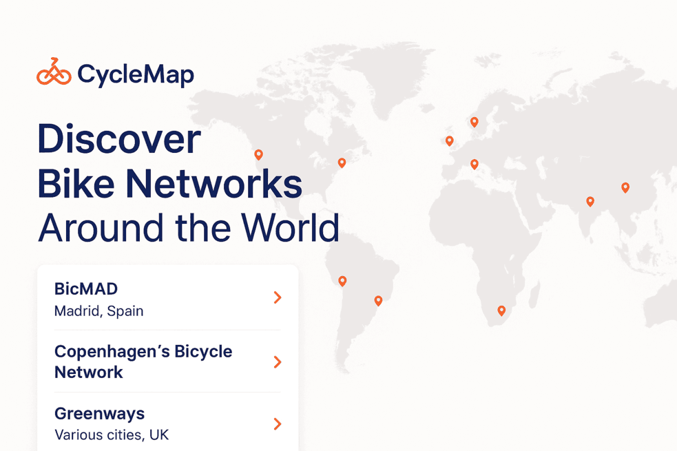

# 🚴‍♂️ CycleMap – Bike Networks Explorer



This React SPA lets users explore bicycle networks worldwide through a rich, accessible, and performant interface, combining server-side rendering, map integration, pagination, and search/filter functionality—all built using modern tooling and best practices.

## Table of Contents

- [Links](#links)
- [Features](#features)
- [Tech Stack](#tech-stack)
- [Folder Structure](#folder-structure)
- [Developer Setup](#developer-setup)
- [License](#license)
- [Final Notes](#final-notes)
- [Acknowledgments](#acknowledgements)

## Links

- Deployed App: https://cyclemap-delta.vercel.app.
- Repository: https://github.com/jeafreezy/cyclemap.

## Features

### Layout & Navigation

- Persistent Layout: Map and sidebar are always present; only inner components update, optimizing rendering and user experience.

- Client & Server Rendering Hybrid:

  - Initial data (bike networks) fetched on the server.

  - Interactive filtering, pagination, and navigation done on the client.

### Map Functionality

- Mapbox GL shows:
  - Bike networks on the main page. The bike networks are clustered for performant rendering.
  - Stations on the detail page.
- Zoom controls.
- Geolocation control.

### Filtering & Search

- Search input: Filters by network name or company, synced with URL `(?search=...)`.

- Country filter: Filters both map and list, synced with URL `(?country=...)`.

- Filters persist on reload.

### Pagination & Sorting

- Networks/stations paginated using a custom hook + `shadcn/ui`.

- Station list sortable by free bikes and empty slots in both directions.

### Guided Tour

Site tour powered by `reactour`, with:

- Tour trigger button.

- Conditional steps per page.

- Dismiss state saved to localStorage.

### SEO Optimized

- OG Image Meta Tags for social previews.
- Sitemap generated from dynamic routes.
- `robots.txt` for proper indexing.
- OG images on network detail pages for social sharing.

### State & Performance

- URL state synced manually with `window.replaceState()` to prevent unnecessary rerenders.

### Accessibility

All interactive elements have:

- aria-labels.
- `shadcn/ui` is built on radix primitives (a11y friendly).

## Tech Stack

- [Next.js (App Router)](https://nextjs.org/docs).
- [TypeScript](https://www.typescriptlang.org/).
- [Tailwind CSS](https://tailwindcss.com/) + custom tokens from the [UI](https://www.figma.com/design/0MNqMneHvxahQZ6pknjzlq/Frontend-Challenge?node-id=5110-10913&t=lPnWiIiq1Z13J7eC-0) kit.
- [Shadcn UI](https://ui.shadcn.com/).
- [Mapbox GL JS](https://docs.mapbox.com/mapbox-gl-js/api/).
- [Reactour](https://docs.react.tours/) for guided tours.
- [Framer motion](https://motion.dev/) for animation.
- [Lucide/React](https://lucide.dev/icons/) for icons.
- [Turf](https://turfjs.org/) for geometry operations (bbox specifically).
- [Tanstack table](https://tanstack.com/table/latest) for table.
- [Sonner](https://sonner.emilkowal.ski/) for toast.
- [Vitest](https://vitest.dev/) + Testing Library for unit tests.

## Folder Structure

Here's an overview of the folder structure:

```markdown
├── app/ - Contains the application routes.
├── assets/ - Static assets specific to the app (images.).
├── components/ - Reusable components and layouts.
├── config/ - Environment variables configuration.
├── hooks/ - Reusable hooks.
├── services/ - API routes and services.
├── types/ - Reusable types.
├── utils/ - Utility functions.
├── \_**\_tests\_\_** - Unit tests.
└── ... Other configuration files like tsconfig.json, .husky, vite.config.mts etc.
```

## Developer Setup

### Prerequisites

- Node.js >=18.
- pnpm >=9.8.0.
- [Mapbox access token](https://mapbox.com/) in `env`. See `.env.example` for list of environment variables. See [here](https://docs.mapbox.com/help/getting-started/access-tokens/) on how to get one.

### Installation

Note: [pnpm](http://pnpm.io/) is used as a package manager. You can use `npm`, `yarn` etc.

```bash
# Clone the repo
git clone https://github.com/jeafreezy/cyclemap.git
cd cyclemap

# Install dependencies
pnpm install

# Create env file
cp .env.example .env
# Add your MAPBOX_ACCESS_TOKEN in .env
```

### Running Locally

```
pnpm dev
```

Open http://localhost:3000 in your browser.

### Code Quality

This project includes strict formatting and linting enforcement via Prettier, ESLint, and Husky.

### Tooling

- **ESLint** – Lints the code for issues.

- **Prettier** – Formats the code consistently.

- **Husky** – Runs pre-commit checks (lint, tests & format) before each commit (tests are added because it's a few. Ideally this should be moved to the CI/CD pipeline).

### Linting, Test & Formatting Commands

```
# Run eslint
pnpm lint

# Run prettier
pnpm format

# Run unit tests
pnpm test
```

## License

See [LICENSE.MD](./LICENSE).

## Improvements & Next Steps

- Make the sidebar transition work.
- Add more tests.
- Make table header sticky on bike network detail page.
- Internalization.

## Final Notes

This is my submission for the [Frontend Code Challenge](https://github.com/Vizzuality/front-end-code-challenge/tree/master/mid-senior) at Vizzuality.
Thank you for the opportunity!

I approached this challenge as I would a production-grade application, prioritizing clean architecture, scalability, accessibility (a11y), and user experience.

I’d be happy to walk you through my thought process, implementation choices, and code in our next conversation.

## Acknowledgments

- [CityBikes API](https://api.citybik.es/v2/) — for the open bike network data.
- [Shadcn/UI](https://ui.shadcn.com/) — for accessible and extensible UI components.
- [Vizzuality Front End Challenge](https://github.com/Vizzuality/front-end-code-challenge/tree/master/mid-senior) — for the challenge with a detailed instruction, UI kit and `countries.json` file.
- [Vercel](https://vercel.com/) for the free deployment.
- The developers of the other packages used in [package.json](./package.json).
